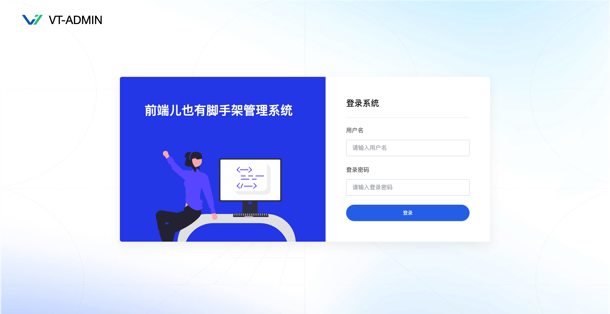

<p align="center">
    <a href="http://vt-admin.duckpear.com" target="_blank" rel="noopener noreferrer"></a>
    <h1 align="center">VT-Admin 管理后台前端模板</h1>
    <br>
</p>

## 介绍

vt-admin 即 vue template for admin，一个用于管理后台的 vue3 模板，或者说是个脚手架，仅提供基础功能，如果你想快速开始一个项目且不喜欢各种臃肿功能绑定在一起的话，那么这个脚手架可能适合你。

## 演示

[http://demo.duckpear.com](http://demo.duckpear.com) 搭建中

## 文档

[http://doc.duckpear.com](http://doc.duckpear.com) 编写中

## 安装依赖

```bash
npm install
````

## 启动预览

```bash
npm run serve
```

## 内置功能

- 登录
- 用户管理
- 角色管理
- 权限管理
- 多语言
- 修改头像
- 修改密码
- 相关示例

## 依赖

在这个脚手架中使用了如下相关依赖库

| 用途            | 包名             | 说明                      |
|---------------|----------------|-------------------------|
| Vue           | Vue3、vuex等     | -                       |
| 系统UI库         | ElementUI Plus | -                       |
| 网络请求          | Axios          | 封装在 `common/utils/http` |
| querystring处理 | qs             |                         |
| 图表            | echarts        | -                       |
| 日期处理          | moment         | -                       |
| 样式处理          | sass(.scss)    | -                       |
| Cookie        | js-cookie      | -                       |
| 编辑器           | CKEditor5      | -                       |

## 目录说明

```
├── assets                               资源目录
│   ├── images                           图片
│   └── styles                           样式
├── charts                               图表配置
├── common                               公用文件
│   ├── constants                        常量
│   ├── data                             静态数据
│   └── utils                            常用功能方法集合
├── components                           公用组件
├── directives                           指令
│   └── HasPermission.js                 权限检测指令
├── main.js                              入口文件
├── modules                              业务模块
├── routes                               路由
├── setting.js                           相关设置
├── store                                状态存储
└── views                                视图
```

## Issues

有任何问题或者 bug 相关请在 Issues 里面提出


## 截图




